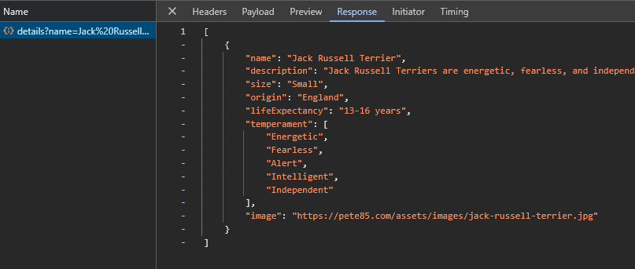
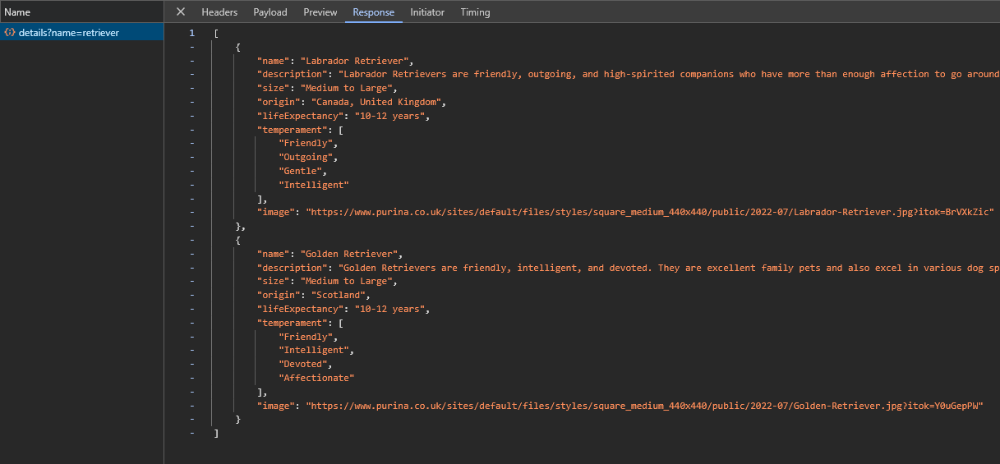
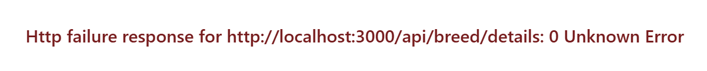

# zigzag-test
 Test for ZigZag

## Introduction

### Requirements

This test has the following required user stories:

1. Create a breed details page &check;
2. Create a breed-details api call (there is a breedlist.json in the backend assets) ✅
3. Add breed-details to the state ✅
4. Make sure the buttons on the overview page route to the detail page ✅
5. Create tests where needed ✅
6. Add comments and/or todos where you want to explain yourself or you'd like changes ✅

In addition, it has one optional requirement which can be selected from the below list:

1. Add a loading state to the application, so when the API is slow the user get’s visual feedback ✅
2. Make a search bar on the overview page to search for a specific breed
3. Create an add breed button which adds a breed to the breed list
4. Make the button on the overview page a separate component
5. Make improvements to the backend, including proper project-wide error handling ✅

As loading state is a standard feature in given scenario, I implemented a simple loader message. On top of
that, I decided to fulfill extra requirement 5.

___

### Problem

There was a big problem with the provided JSON data. Jack Russell Terrier was missing. I fixed this issue
and added a picture of my dog, Gucci.


___

## Configuration

### Private vs public

I used underscores for private variables to distinguish them from the public ones more easily.

```typescript
private _store = inject(Store);
private _route = inject(ActivatedRoute);
```

### Restructuring

Front-end part of the app was organised in the below directories. This helps in
navigating between the parts of the app.

* components
* services
* interfaces
* state
* styles

### Layout & responsiveness

For improved layout setup and responsive design, I introduced Tailwind. With that in place,
I used a mobile first approach. For this test, I focused entirely on the BreedDetailsComponent.

___

## Front-end

### Interfaces

Interfaces were added for strong typing of the state and breed.

### NgRx

Actions, reducers and effects were modified to accommodate the selected breed.

In addition to updating the above, I also added selectors. Selectors provide a
consistent and centralized way to access specific parts of the state. The goal
was to follow recommended approach and avoid components accessing the state directly.

I introduced ActionTypes for cleaner structure

```typescript
export enum ActionTypes {
  GET_BREED_LIST = '[Breed] Get Breed List',
  GET_BREED_LIST_SUCCESS = '[Breed] Get Breed List Success',
  GET_BREED_LIST_FAILURE = '[Breed] Get Breed List Failure',
  SELECT_BREED = '[Breed] Select Breed',
  GET_BREED_DETAILS = '[Breed] Get Breed Details',
  GET_BREED_DETAILS_SUCCESS = '[Breed] Get Breed Details Success',
  GET_BREED_DETAILS_FAILURE = '[Breed] Get Breed Details Failure',
}
```

___

## Back-end

Two options for getting breed details are available in BreedController.
Initially, I implemented the _getBreedDetails_. However, I thought it would be good to also 
demonstrate a conditional approach, utilising the existing _getBreeds_

### Test

#### getBreedDetails

```typescript
http://localhost:3000/api/breed/details?name=jack russell terrier
```

Example

http://localhost:3000/api/breed?name=labr

#### getBreeds

```typescript
http://localhost:3000/api/breed?name=labr
```

Example

http://localhost:3000/api/breed/details?name=shep

___

API was implemented with flexibility in mind. As the endpoint accepts partial name string, it can be
easily used for scenarios that require autocomplete or filtering.

___

Exact match



___

Multiple matches



___

### Error handling / validation

Centralised approach towards error handling was implemented in **AppExceptionFilter**, which
intercepts errors before they propagate through the application. A standardised JSON response 
was configured. This includes the statusCode, timestamp, URL and error message.

When an exception is thrown, AppExceptionFilter acts in one of two available ways.

1. HttpException - filter extracts status and response message
2. Non HttpException - defaults to 500 status and serves a generic error message

#### main.ts

```typescript
import {AppExceptionFilter} from './app/filters/exceptions-filter';
...

async function bootstrap() {
  const app = await NestFactory.create(BreedModule);
  app.useGlobalFilters(new AppExceptionFilter());
  ...
}

bootstrap();
```

Example - invalid name

http://localhost:4200/breed/Unknown



#### breed.service.ts

```typescript
import { Injectable, Logger, NotFoundException } from '@nestjs/common';
...

@Injectable()
export class BreedService {

  private readonly _logger = new Logger(BreedService.name);
  
  getBreedByName(breedName: string): Breed[] {
    const breedInfos: Breed[] = JSON.parse(JSON.stringify(breedList));

    const matchingBreeds = breedInfos.filter((breedInfo) =>
      breedInfo.name.toLowerCase().includes(breedName.toLowerCase()),
    );

    // Exception configuration
    if (matchingBreeds.length === 0) {
      this._logger.warn(`No breeds found matching name: ${breedName}`);
      throw new NotFoundException(`No breeds found matching name: ${breedName}`);
    }

    return matchingBreeds;
  }

}
```

___

## Testing

What has been tested?

Back-end

1. AppExceptionFilter
2. BreedService

Front-end

1. OverviewPageComponent
2. BreedDetailsComponent
3. BreedService
4. BreedEffects

### back-end

```typescript
npm run test:backend
```

### front-end

```typescript
npm run test:frontend
```

### all

```typescript
npm run test:all
```

## Running app

### back-end

```typescript
npm run serve:backend
```

### front-end

```typescript
npm run serve:frontend
```

### all

```typescript
npm start
```
